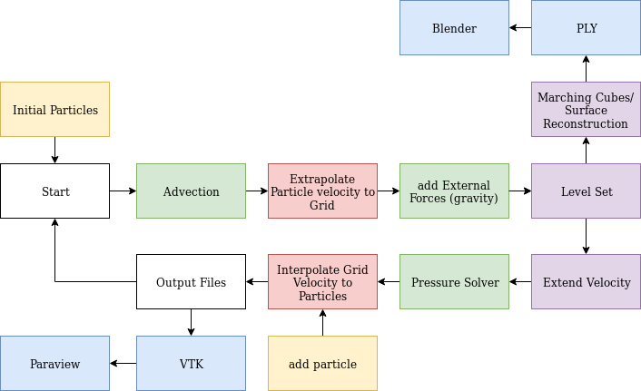

# PBS Project: FLIP Fluid Solver
### Created by Tom Lausberg and Safira Piasko
Contact: [toml@ethz.ch](mailto:toml@ethz.ch), [spiasko@ethz.ch](mailto:spiasko@ethz.ch)


### Dependancies
- Eigen (version 3.3)
- visit_writer (included in source code)
- CMake/Make

### Build System
A CMakeLists.tct file is include in the home directory for building the code.
#### Compiling (linux)

Run the following commands in the `./build` directory:
Create the build scripts and compile the code
```sh
cmake ..
make
```
run the program `flip_solver` to create the output files. To create output respective files, the directories `ply`, `ply_ref` & `data` must be present in the directory where the program is executed.

### Output files:
##### Data:
- `pressure.vtk.*` contains a grid of pressure values in the ascii vtk format
- `cells.vtk.*` contains a grid of with the cell type in the ascii vtk format
  (AIR: 0,FLUID: 1, SOLID: 2, INTERFACE: 3)
- `velocity.vtk.*` contains a grid of u,v,w velocity values in the ascii vtk format
##### Ply:
- `surface_*.ply` contains a sequence of .ply (stanford) files which represent the surface of the liquid as a triangle mesh

### Implemented functions


---
#### Data Structures:
- Grid: templated data structure which stores the different values in the mac grid. The underlying datastructure is an `Eigen::Tensor`. The size of the grid is defined by the marco variables `X_DIM`,`Y_DIM`&`Z_DIM` all defined in `util.hpp`
- Particle: Stores the position and velocity of a single particle
- Vec3: simple structure for storing three doubles.

---
#### Simulation class
- Constructor `Simulation(double dt, double dx, double density)`: Initialises a Simulation
- `add_particles(std::vector<Particles>)`: appends list particles to the simulation
- `run(int steps, int steps_per_frame)`: runs simulation for a certain amount of steps
- `step()`: calls the different functions for the FLIP algorithm in each timestep

---
#### Particle sources
- `initialise_NPerCell()`: Returns an `x` by `y` by `z` cell box starting at the point `Origin`. Each cell contains n^3 particles.
- `void source_particles(int x, int y, int z, int n, Vec3 origin)`: similar to initialise_NPerCell() but keeps adding new particles in every timestep if the cell is empty. This function is called in the `step()` function of the simulation class.
- `void source_cylinder()`: creates a continuous stream in a circle at the defined position.

---
#### Advection
- `simpleAdvect()`: Uses the Forward-Euler method for advecting Particles
- `updateParticlePositions()`: Uses a 2nd Order Runge-Kutta Method for advecting Particles
---

#### Grid-Particle Interactions
-`particleToGrid()`: splats the particle velocity to the grid with trilinear interpolation.
-`cubicSplineToGrid()`: splats the particle velocity to the grid using a cubic spline SPH kernel.
-`gridVelocityToParticles():` uses trilinear interpolation to update the particle velocities

---
#### Pressure solver
`pressure_solver()`: Creates a laplacian matrix & divergence vector for the current time step and solves the system using the Eigen `ConjugateGradient` sovler. It the calculates the new velocities with the pressure difference between the different cells.

---
#### Velocity extension and level set method
- `levelset()`,`refined_levelset()`: calculates a signed distance to the fluid surface. Values inside the fluid are set to -0.5. The refined version samples the grid at an integer multiple of the original grid (We set sampled at twice the resolution for all simulations).
- `marchingCubes()`,`refined_marchingCubes()`: Sweeps over the distance matrix calculated by the `levelset()` function and outputs a set of triangles on the surface of the liquid where distance = 0. The refined version can sweep over grids of higher resolutions.
- `extend_velocity()`: extends the velocity of the fluid over the grid using the distance calculated with the `levelset()` function. The velocity is extended by sweeping over the grid.

---
#### Boundary Conditions
- `clampBoundary()`: sets boundary values for a grid.
- `checkParticles()`: deletes all particles that are not in the simulation domain.
- `applyBC()`: sets the boundary layer to SOLID and the normal velocity to 0.

---
#### Output methods
Data: vtk/csv
- `write_frame()`: calls the separate writer functions in each timestep
- `write_velocity()`: outputs a `poly_vertex` set of points for the x, y & z components of the velocity at the correct positions on the MAC grid.  
- `write_pressure()`,`write_cells`: outputs an `unstructured grid` with the same dimension as the grid. The file format is legacy ascii `.vtk` and uses the `visit_writer::write_rectilinear_mesh()` function.  
- `write_to_csv()`: Stores particle positons as x, y & z coordinates in a .csv file.

---
Ply/Ply_ref:
The `ply` directory contains mesh structures which are created with the original resoluton of the grid. `ply_ref` contains meshes which are sampled at a higher resolution. The set of .ply file can imported into blender using the 'stop-motion-obj' blender plugin [github link](https://github.com/neverhood311/Stop-motion-OBJ).
- `write_ply()`: outputs the triangle mesh constructed in the `marchingCubes()` method as a stanford `.ply` file.

---
